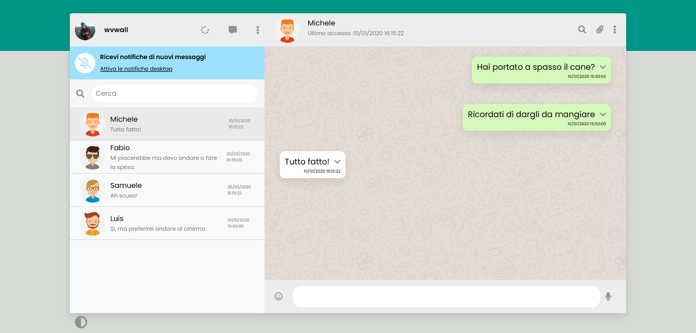
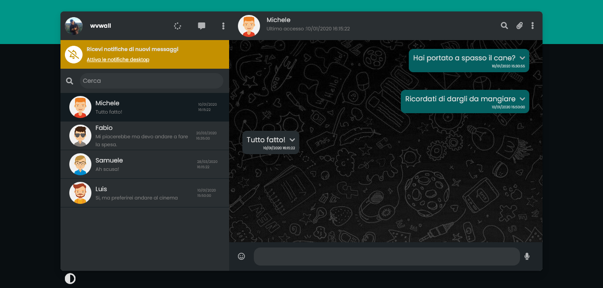

vue-boolzapp

Milestone 1
● Replica della grafica c on l a possibilità di avere messaggi scritti dall’utente (verdi) e
dall’interlocutore (bianco) assegnando due classi CSS diverse
● Visualizzazione dinamica della lista contatti: tramite l a direttiva v-for, visualizzare
nome e i mmagine di ogni contatto

Milestone 2
● Visualizzazione dinamica dei messaggi: t ramite l a direttiva v-for, visualizzare tutti i
messaggi relativi al contatto attivo all’interno del pannello della conversazione
● Click sul contatto mostra l a conversazione del contatto cliccato

Milestone 3
● Aggiunta di un messaggio: l ’utente scrive un testo nella parte bassa e digitando
“enter” i l testo viene aggiunto al thread sopra, come messaggio verde
● Risposta dall’interlocutore: a d ogni i nserimento di un messaggio, l ’utente riceverà
un “ok” come risposta, che apparirà dopo 1 secondo.

Milestone 4
● Ricerca utenti: s crivendo qualcosa nell’input a sinistra, vengono visualizzati solo i
contatti i l cui nome contiene l e l ettere i nserite (es, Marco, Matteo Martina -> Scrivo
“mar” rimangono solo Marco e Martina)

Milestone 5 - opzionale
● Cancella messaggio: c liccando sul messaggio appare un menu a tendina che
permette di cancellare i l messaggio selezionato
● Visualizzazione ora e ultimo messaggio inviato/ricevuto nella l ista dei contatti